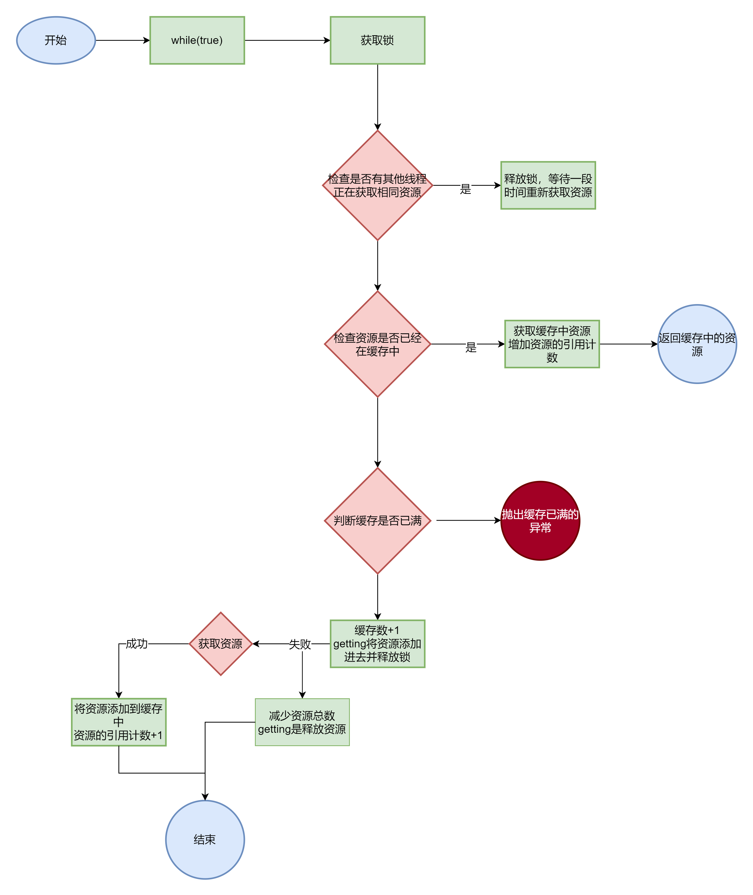
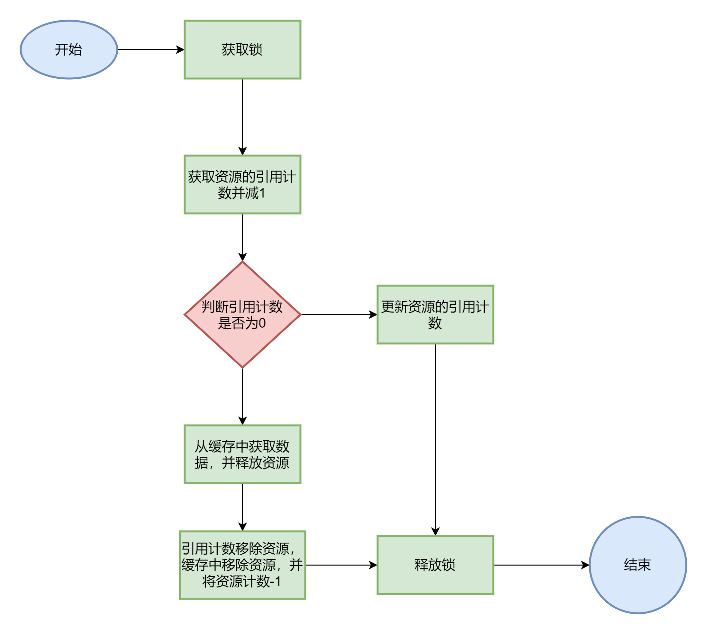
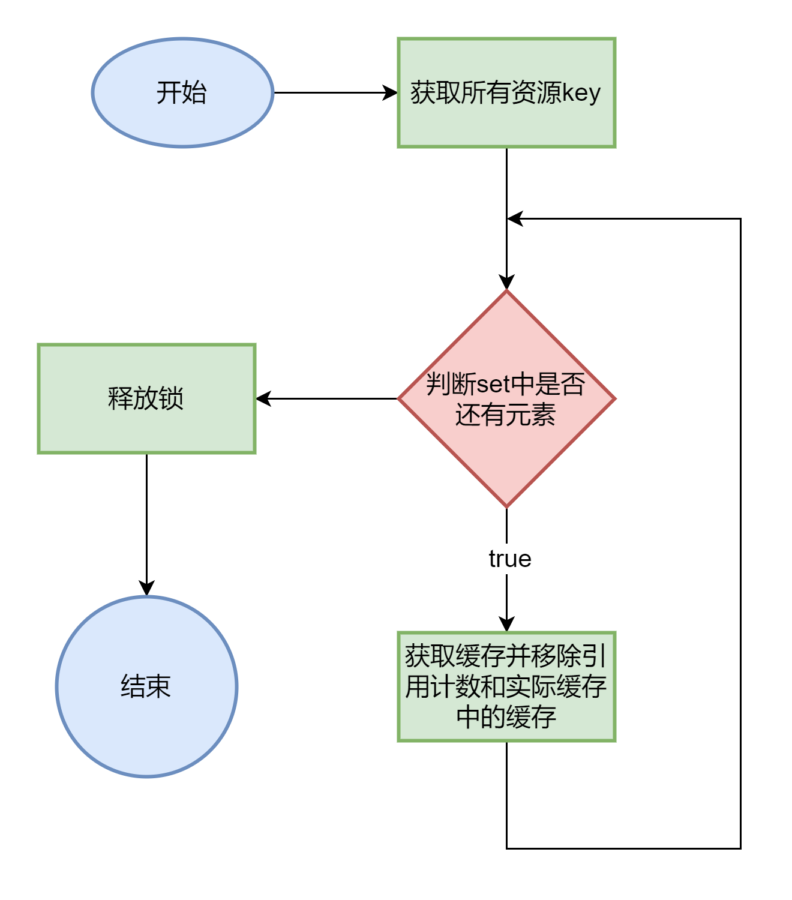

> 本章涉及代码：com/dyx/simpledb/backend/common/AbstractCache.java

### 引用计数缓存框架

在数据库系统中，缓存策略对于性能的影响至关重要。传统的 LRU（最近最少使用）策略通常用于管理缓存，但在某些情况下，引用计数策略可能更为有效，尤其是在涉及回源操作时。

#### 回源

**回源操作**指的是当需要的数据不在内存缓存中时，从持久化存储（如磁盘）中重新加载数据到内存的过程。由于内存的访问速度远高于磁盘，数据库系统通常尽量将数据保留在内存中以提高性能。当需要访问的数据不在缓存中时，系统必须执行回源操作，从磁盘读取数据并加载到内存。这种操作通常会带来较大的性能开销，因为磁盘 I/O 速度远低于内存访问速度。

#### 引用计数策略的优势

在 EasyDB 系统中，为了更好地控制资源管理和回源操作，采用了**引用计数策略**。相比 LRU 策略，引用计数策略通过以下方式优化了回源操作：

1. **资源管理可控**：在引用计数策略中，资源的释放由上层模块主动触发，而不是由缓存系统自动决定。这意味着只有在上层模块明确表示不再需要某个资源时，缓存才会将其移除。这种机制避免了 LRU 策略中可能出现的资源被意外驱逐而导致的回源操作。
2. **避免不必要的回源**：在 LRU 策略中，资源可能会因为缓存满而被驱逐，导致需要时再从磁盘加载回源。引用计数策略通过引用计数的管理，确保资源只有在引用次数为零时才会被驱逐，这减少了不必要的回源操作，降低了系统的 I/O 开销。
3. **缓存满时的处理**：在引用计数策略中，如果缓存已满且没有可释放的资源，系统会直接抛出异常而不是自动驱逐资源。这避免了缓存抖动问题，确保系统在高并发情况下的稳定性。

#### 实际应用中的回源与缓存管理

在 EasyDB 的引用计数缓存框架中，回源操作的管理通过以下流程实现：

- **缓存未命中**：当系统需要的数据不在缓存中时，首先检查其他线程是否正在获取该资源。如果是，当前线程会稍后再试，避免重复回源。这通过 `getting` 这个 `HashMap` 来管理正在获取的资源。
- **从数据源获取资源**：如果缓存未命中且没有其他线程在获取该资源，系统会从磁盘中回源获取数据，并将其加载到缓存中。获取完成后，缓存会记录该资源的引用次数，确保在资源被主动释放前不会被驱逐。
- **资源释放与驱逐**：当上层模块不再需要某个资源时，通过调用 `release` 方法释放对该资源的引用。如果引用次数归零，缓存会将该资源从内存中移除，确保内存资源的有效利用。
- **缓存关闭**：在系统关闭时，引用计数缓存框架会安全地释放所有资源，并将必要的数据写回磁盘，确保数据的一致性和完整性。

### 引用计数缓存框架的实现

#### `AbstractCache<T>` 抽象类

引用计数缓存框架的核心是 `AbstractCache<T>` 抽象类，其中包含两个需要子类实现的抽象方法，用于在缓存未命中时获取资源和在资源被驱逐时进行必要的处理：

```java
/**
 * 当资源不在缓存时的获取行为
 */
protected abstract T getForCache(long key) throws Exception;

/**
 * 当资源被驱逐时的写回行为
 */
protected abstract void releaseForCache(T obj);
```

#### 引用计数管理

为了管理资源的引用计数，`AbstractCache` 维护了三个核心的 `HashMap`：

```java
private HashMap<Long, T> cache;                     // 实际缓存的数据
private HashMap<Long, Integer> references;          // 资源的引用个数
private HashMap<Long, Boolean> getting;             // 正在获取资源的线程标记
```

1. **cache**：存储实际缓存的数据。
2. **references**：记录每个资源的引用计数。
3. **getting**：标记哪些资源当前正在从数据源获取，以避免并发情况下重复获取相同的资源。

#### 获取资源 `get(long key)`

当需要获取资源时，`get(long key)` 方法会首先检查资源是否已经在缓存中，如果在，则增加其引用计数并返回。如果不在，则通过 `getForCache` 方法从数据源获取资源并缓存。  


```java
//从缓存中获取资源
protected T get(long key) throws Exception {
    // 循环直到获取资源
    while (true) {
        // 获取锁
        lock.lock();
        if (getting.containsKey(key)) {
            // 如果其他线程正在获取这个资源，那么当前线程将等待一毫秒然后继续循环
            lock.unlock();
            try {
                Thread.sleep(1);
            } catch (InterruptedException e) {
                e.printStackTrace();
                continue;
            }
            continue;
        }

        if (cache.containsKey(key)) {
            // 如果资源已经在缓存中，直接返回资源，并增加引用计数
            T obj = cache.get(key);
            references.put(key, references.get(key) + 1);
            lock.unlock();
            return obj;
        }

        // 如果资源不在缓存中，尝试获取资源。如果缓存已满，抛出异常
        if (maxResource > 0 && count == maxResource) {
            lock.unlock();
            throw Error.CacheFullException;
        }
        count++;
        getting.put(key, true);
        lock.unlock();
        break;
    }

    // 尝试获取资源
    T obj = null;
    try {
        obj = getForCache(key);
    } catch (Exception e) {
        lock.lock();
        count--;
        getting.remove(key);
        lock.unlock();
        throw e;
    }

    // 将获取到的资源添加到缓存中，并设置引用计数为1
    lock.lock();
    getting.remove(key);
    cache.put(key, obj);
    references.put(key, 1);
    lock.unlock();

    return obj;
}
```

#### 释放资源 `release(long key)`

当上层模块不再需要某个资源时，通过 `release(long key)` 方法减少引用计数。如果引用计数归零，资源将从缓存中移除，并通过 `releaseForCache` 方法执行必要的回源处理。  


```java
/**
 * 强行释放一个缓存
 */
protected void release(long key) {
    lock.lock(); // 获取锁
    try {
        int ref = references.get(key) - 1; // 获取资源的引用计数并减一
        if (ref == 0) { // 如果引用计数为0
            T obj = cache.get(key); // 从缓存中获取资源
            releaseForCache(obj); // 处理资源的释放
            references.remove(key); // 从引用计数的映射中移除资源
            cache.remove(key); // 从缓存中移除资源
            count--; // 将缓存中的资源计数减一
        } else { // 如果引用计数不为0
            references.put(key, ref); // 更新资源的引用计数
        }
    } finally {
        lock.unlock(); // 释放锁
    }
}
```

#### 关闭缓存 `close()`

在系统关闭时，`close()` 方法会确保缓存中的所有资源都被安全地释放，并将需要持久化的数据写回数据源，避免数据丢失。  


```java
/**
 * 关闭缓存，写回所有资源
 */
protected void close() {
    lock.lock();
    try {
        //获取所有资源key
        Set<Long> keys = cache.keySet();
        for (long key : keys) {
            //获取缓存
            T obj = cache.get(key);
            //释放缓存
            releaseForCache(obj);
            //引用计数移除缓存
            references.remove(key);
            //实际缓存移除缓存
            cache.remove(key);
        }
    } finally {
        //释放锁
        lock.unlock();
    }
}
```

### 总结

引用计数缓存框架结合了灵活的资源管理和有效的回源策略，在提高系统性能的同时，避免了 LRU 策略可能引发的问题。通过引用计数，系统能够确保资源的有效使用和及时释放，减少不必要的回源操作，提高了系统的整体效率和稳定性。
:::tip
**本文作者：**[blockCloth](https://github.com/blockCloth)  
**部分内容转载自：**[https://shinya.click/projects/mydb/mydb2](https://shinya.click/projects/mydb/mydb2)  
**版权声明：** 本博客所有文章除特别声明外，均采用 [CC BY-NC-SA 4.0](https://creativecommons.org/licenses/by/4.0/legalcode.zh-hans)许可协议。转载请注明来自 [blockCloth](https://github.com/blockCloth)
:::