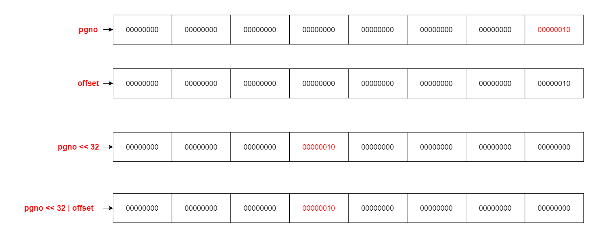
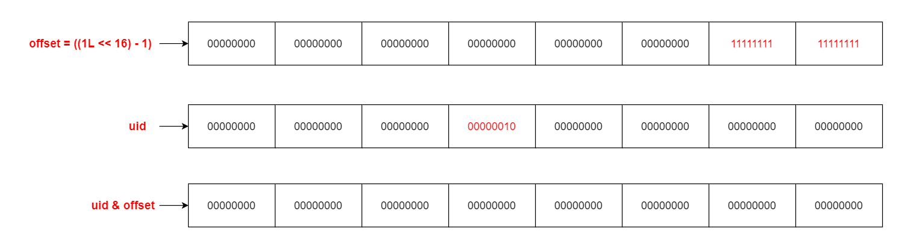

> 本章涉及代码：com/dyx/simpledb/backend/dm/dataItem/*；com/dyx/simpledb/backend/dm/*；

### DataItem 的实现

`DataItem` 是数据库系统中的数据抽象层，负责存储和管理具体的数据内容，并为上层模块提供访问接口。它主要提供以下功能：

1. **数据存储和访问**：`DataItem` 存储了数据的具体内容，以及相关的元数据信息如数据大小和有效标志等。上层模块可以通过 `DataItem` 对象读取或修改数据内容。
2. **数据修改与事务管理**：`DataItem` 支持数据的修改操作，并在修改操作前后执行保存原始数据、记录日志等流程，以确保数据修改的原子性和一致性。
3. **数据共享与内存管理**：`DataItem` 的数据内容通过 `SubArray` 对象返回给上层模块，避免数据拷贝，提高了数据访问效率，并减少了内存开销。
4. **缓存管理**：`DataItem` 对象由底层 `DataManager` 缓存管理，使用 `release()` 方法可以释放缓存中的 `DataItem` 对象，以便回收内存资源。

#### DataItem 的数据结构

`DataItem` 中保存的数据结构如下：

```
[ValidFlag] [DataSize] [Data]
```

- **ValidFlag**：1 字节，表示该 `DataItem` 是否有效。删除 `DataItem` 只需将其有效位设置为 0。
- **DataSize**：2 字节，表示 `Data` 部分的长度。

```java
public class DataItemImpl implements DataItem {
    private SubArray raw; // 原始数据
    private byte[] oldRaw; // 旧的原始数据
    private DataManagerImpl dm; // 数据管理器
    private long uid; // 唯一标识符
    private Page pg; // 页面对象
}
```

#### DataItem 的关键方法

1. **数据访问**：`data()`

- 返回 `DataItem` 中的数据部分，不进行数据拷贝，直接返回原始数据的引用。

```java
@Override
public SubArray data() {
    return new SubArray(raw.raw, raw.start + OF_DATA, raw.end);
}
```

2. **数据修改前准备**：`before()`

- 在修改数据项之前调用，锁定数据项并保存原始数据，以支持事务回滚。

```java
@Override
public void before() {
    wLock.lock();
    pg.setDirty(true);
    System.arraycopy(raw.raw, raw.start, oldRaw, 0, oldRaw.length);
}
```

3. **回滚修改**：`unBefore()`

- 在需要撤销修改时调用，恢复原始数据并解锁数据项。

```java
@Override
public void unBefore() {
    System.arraycopy(oldRaw, 0, raw.raw, raw.start, oldRaw.length);
    wLock.unlock();
}
```

4. **完成修改**：`after()`

- 修改完成后调用，记录日志并解锁数据项。

```java
@Override
public void after(long xid) {
    dm.logDataItem(xid, this);
    wLock.unlock();
}
```

5. **释放缓存**：`release()`

- 使用完 `DataItem` 后，调用 `release()` 方法释放缓存。

```java
@Override
public void release() {
    dm.releaseDataItem(this);
}
```

### DataManager 的实现

`DataManager` 是数据库系统中的核心组件，负责管理底层数据的访问、修改和事务处理。它是 `DM` 层直接对外提供方法的类，同时也实现了对 `DataItem` 对象的缓存管理。`DataItem` 存储的 `key` 是由页号和页内偏移组成的一个 8 字节无符号整数，页号和偏移各占 4 字节。

#### DataManager 的核心功能

1. **数据缓存与管理**：`DataManager` 通过缓存 `DataItem` 对象，提供高效的数据访问。`DataItem` 的 `key` 是一个 8 字节无符号整数，其中页号和页内偏移各占 4 字节。这种设计允许快速定位和访问数据，减少了对底层存储的频繁访问。
2. **数据访问与操作**：`DataManager` 提供了读取、插入和修改等数据操作方法。通过这些方法，数据库的上层模块可以方便地对数据进行操作。
3. **事务管理**：`DataManager` 支持事务管理，确保数据操作的原子性。事务管理能够保证在事务提交或回滚时，数据的一致性和完整性。
4. **日志记录与恢复**：`DataManager` 在数据修改操作前后执行日志记录，以确保数据的安全性和可靠性，并支持系统崩溃后的数据恢复。
5. **页面索引管理**：`DataManager` 还实现了页面索引管理功能，通过页面索引，可以快速定位到合适的空闲空间，提高数据插入的效率和性能。
6. **文件初始化与校验**：`DataManager` 在创建和打开数据库文件时，进行文件的初始化和校验，确保文件的正确性和完整性。

#### DataManager 的 Uid 的生成与解析

`DataItem` 在 `DataManager` 中的存储和管理是通过一个唯一标识符 `Uid` 来实现的。这个 `Uid` 是由页面编号 (`pgno`) 和页面内偏移量 (`offset`) 组成的一个 8 字节无符号整数，其中页号和偏移量各占 4 字节。这里以`pgno = 2 和 offset = 0`来演示生成和解析 `Uid` 的详细过程。

1. **生成 Uid**
   通过将页面编号 (`pgno`) 和偏移量 (`offset`) 组合成一个 8 字节无符号整数来生成 `Uid`。这里使用了位移和按位或运算。  


```java
public class Types {
    public static long addressToUid(int pgno, short offset) {
        long u0 = (long) pgno;
        long u1 = (long) offset;
        return u0 << 32 | u1; // 左移32位表示页号，按位或运算将页号和偏移量合并成一个Uid
    }
}
```

2. **从 Uid 中提取偏移量 (**`**offset**`**)**
   为了从 `Uid` 中提取出偏移量，需要对 `Uid` 进行按位与运算。偏移量是 `Uid` 的低 16 位，通过与 16 位全1（`0xFFFF`）进行按位与操作可以提取出偏移量。  


```java
// 提取偏移量，偏移量占 Uid 的低16位
short offset = (short) (uid & ((1L << 16) - 1)); // 按位与操作提取出低16位的偏移量
```

3. **从 Uid 中提取页面编号 (**`**pgno**`**)**
   提取页面编号则需要将 `Uid` 右移 32 位，以便将高 32 位对齐到低位，然后通过按位与操作提取出页面编号。  


```java
// 右移32位，将高32位对齐到低位
uid >>>= 32;
// 提取页面编号，页面编号占 Uid 的高32位
int pgno = (int) (uid & ((1L << 32) - 1)); // 按位与操作提取出页面编号
```

##### `getForCache()`

也是继承自`AbstractCache`，只需要从 key 中解析出页号，从 pageCache 中获取到页面，再根据偏移，解析出 DataItem 即可

```java
@Override
protected DataItem getForCache(long uid) throws Exception {
    // 从 uid 中提取出偏移量（offset），这是通过位操作实现的，偏移量是 uid 的低16位
    short offset = (short) (uid & ((1L << 16) - 1));
    // 将 uid 右移32位，以便接下来提取出页面编号（pgno）
    uid >>>= 32;
    // 从 uid 中提取出页面编号（pgno），页面编号是 uid 的高32位
    int pgno = (int) (uid & ((1L << 32) - 1));
    // 使用页面缓存（pc）的 getPage(int pgno) 方法根据页面编号获取一个 Page 对象
    Page pg = pc.getPage(pgno);
    // 使用 DataItem 接口的静态方法 parseDataItem(Page pg, short offset, DataManagerImpl dm)
    // 根据获取到的 Page 对象、偏移量和当前的 DataManagerImpl 对象（this）解析出一个 DataItem 对象，并返回这个对象
    return DataItem.parseDataItem(pg, offset, this);
}
```

##### `releaseForCache()`

DataItem 缓存释放，需要将 DataItem 写回数据源，由于对文件的读写是以页为单位进行的，只需要将 DataItem 所在的页 release 即可：

```java
@Override
protected void releaseForCache(DataItem di) {
    di.page().release();
}
```

#### DataManager 的核心方法

1. **读取数据**：`read()`

- 根据 `Uid` 从缓存中获取 `DataItem`，并校验其有效性。`DataItem` 的 `Uid` 是由页号和页内偏移组成的一个 8 字节无符号整数。

```java
@Override
public DataItem read(long uid) throws Exception {
    //从缓存页面中读取到DataItemImpl
    DataItemImpl di = (DataItemImpl) super.get(uid); // 若缓存中不存在则调用 getForCache() 方法
    //校验di是否有效
    if (!di.isValid()) {
        // 无效释放缓存
        di.release();
        return null;
    }
    return di;
}
```

2. **插入数据**：`insert()`

- 在 `PageIndex` 中选择一个合适的页面进行插入操作，记录插入日志，并返回插入位置的偏移。插入的位置和页面信息都是通过页号和偏移量进行管理的。  
.png)

```java
@Override
public long insert(long xid, byte[] data) throws Exception {
    // 将输入的数据包装成DataItem的原始格式
    byte[] raw = DataItem.wrapDataItemRaw(data);
    // 如果数据项的大小超过了页面的最大空闲空间，抛出异常
    if (raw.length > PageX.MAX_FREE_SPACE) {
        throw Error.DataTooLargeException;
    }

    // 初始化一个页面信息对象
    PageInfo pi = null;
    // 尝试5次找到一个可以容纳新数据项的页面
    for (int i = 0; i < 5; i++) {
        // 从页面索引中选择一个可以容纳新数据项的页面
        pi = pIndex.select(raw.length);
        // 如果找到了合适的页面，跳出循环
        if (pi != null) {
            break;
        } else {
            // 如果没有找到合适的页面，创建一个新的页面，并将其添加到页面索引中
            int newPgno = pc.newPage(PageX.initRaw());
            pIndex.add(newPgno, PageX.MAX_FREE_SPACE);
        }
    }
    // 如果还是没有找到合适的页面，抛出异常
    if (pi == null) {
        throw Error.DatabaseBusyException;
    }

    // 初始化一个页面对象
    Page pg = null;
    // 初始化空闲空间大小为0
    int freeSpace = 0;
    try {
        // 获取页面信息对象中的页面
        pg = pc.getPage(pi.pgno);
        // 生成插入日志
        byte[] log = Recover.insertLog(xid, pg, raw);
        // 将日志写入日志文件
        logger.log(log);

        // 在页面中插入新的数据项，并获取其在页面中的偏移量
        short offset = PageX.insert(pg, raw);

        // 释放页面
        pg.release();
        // 返回新插入的数据项的唯一标识符
        return Types.addressToUid(pi.pgno, offset);

    } finally {
        // 将页面重新添加到页面索引中
        if (pg != null) {
            pIndex.add(pi.pgno, PageX.getFreeSpace(pg));
        } else {
            pIndex.add(pi.pgno, freeSpace);
        }
    }
}

/**
 *  返回一个完整的 DataItem 结构数据
 *  dataItem 结构如下：
 *  [ValidFlag] [DataSize] [Data]
 *  ValidFlag 1字节，0为合法，1为非法
 *  DataSize  2字节，标识Data的长度
 * @param raw
 * @return
 */
public static byte[] wrapDataItemRaw(byte[] raw) {
    byte[] valid = new byte[1]; //证明此时为非法数据
    byte[] size = Parser.short2Byte((short)raw.length); //计算数据字节大小
    return Bytes.concat(valid, size, raw); //拼接DataItem 结构数据
}

/**
 * 根据给定的空间大小选择一个 PageInfo 对象。
 *
 * @param spaceSize 需要的空间大小
 * @return 一个 PageInfo 对象，其空闲空间大于或等于给定的空间大小。如果没有找到合适的 PageInfo，返回 null。
 */
public PageInfo select(int spaceSize) {
lock.lock(); // 获取锁，确保线程安全
try {
    int number = spaceSize / THRESHOLD; // 计算需要的空间大小对应的区间编号
    // 此处+1主要为了向上取整
    /*
            1、假需要存储的字节大小为5168，此时计算出来的区间号是25，但是25*204=5100显然是不满足条件的
            2、此时向上取整找到 26，而26*204=5304，是满足插入条件的
         */
    if (number < INTERVALS_NO) number++; // 如果计算出的区间编号小于总的区间数，编号加一
    while (number <= INTERVALS_NO) { // 从计算出的区间编号开始，向上寻找合适的 PageInfo
        if (lists[number].size() == 0) { // 如果当前区间没有 PageInfo，继续查找下一个区间
            number++;
            continue;
        }
        return lists[number].remove(0); // 如果当前区间有 PageInfo，返回第一个 PageInfo，并从列表中移除
    }
    return null; // 如果没有找到合适的 PageInfo，返回 null
} finally {
    lock.unlock(); // 释放锁
}
}

// 定义一个静态方法，用于创建插入日志
public static byte[] insertLog(long xid, Page pg, byte[] raw) {
    // 创建一个表示日志类型的字节数组，并设置其值为LOG_TYPE_INSERT
    byte[] logTypeRaw = {LOG_TYPE_INSERT};
    // 将事务ID转换为字节数组
    byte[] xidRaw = Parser.long2Byte(xid);
    // 将页面编号转换为字节数组
    byte[] pgnoRaw = Parser.int2Byte(pg.getPageNumber());
    // 获取页面的第一个空闲空间的偏移量，并将其转换为字节数组
    byte[] offsetRaw = Parser.short2Byte(PageX.getFSO(pg));
    // 将所有字节数组连接在一起，形成一个完整的插入日志，并返回这个日志
    return Bytes.concat(logTypeRaw, xidRaw, pgnoRaw, offsetRaw, raw);
}

// 将raw插入pg中，返回插入位置
public static short insert(Page pg, byte[] raw) {
    pg.setDirty(true); // 将pg的dirty标志设置为true，表示pg的数据已经被修改
    short offset = getFSO(pg.getData()); // 获取pg的空闲空间偏移量
    System.arraycopy(raw, 0, pg.getData(), offset, raw.length); // 将raw的数据复制到pg的数据中的offset位置
    setFSO(pg.getData(), (short) (offset + raw.length)); // 更新pg的空闲空间偏移量
    return offset; // 返回插入位置
}
```

3. **关闭 DataManager**：`close()`

- 正常关闭时，执行缓存和日志的关闭流程，并设置第一页的字节校验。

```java
@Override
public void close() {
    super.close();
    logger.close();

    PageOne.setVcClose(pageOne);
    pageOne.release();
    pc.close();
}
```

#### DataManager 的初始化

1. **从空文件创建**：`create()`

- 初始化 `PageCache` 和 `Logger`，并初始化第一页。  
.png)

```java
public static DataManager create(String path, long mem, TransactionManager tm) {
    PageCache pc = PageCache.create(path, mem);
    Logger lg = Logger.create(path);

    DataManagerImpl dm = new DataManagerImpl(pc, lg, tm);
    dm.initPageOne();
    return dm;
}
```

2. **从已有文件打开**：`open()`

- 加载并检查第一页，必要时执行恢复操作，并填充 `PageIndex`。  
.png)

```java
public static DataManager open(String path, long mem, TransactionManager tm) {
    PageCache pc = PageCache.open(path, mem);
    Logger lg = Logger.open(path);

    DataManagerImpl dm = new DataManagerImpl(pc, lg, tm);
    if (!dm.loadCheckPageOne()) {
        Recover.recover(tm, lg, pc);
    }
    dm.fillPageIndex();
    PageOne.setVcOpen(dm.pageOne);
    dm.pc.flushPage(dm.pageOne);

    return dm;
}
```

### 总结

`DataItem` 和 `DataManager` 是数据库系统中数据管理的关键组件。`DataItem` 提供了数据的存储和访问接口，支持数据修改和事务管理。而 `DataManager` 负责管理底层数据的访问、缓存、事务处理和日志记录，通过这些功能的实现，为上层模块提供了安全、高效的数据操作接口。两者的协作使得数据库系统能够以高效、可靠的方式管理和操作底层数据，确保数据的安全性和一致性。
:::tip
**本文作者：**[blockCloth](https://github.com/blockCloth)  
**部分内容转载自：**[https://shinya.click/projects/mydb/mydb5](https://shinya.click/projects/mydb/mydb5)  
**版权声明：** 本博客所有文章除特别声明外，均采用 [CC BY-NC-SA 4.0](https://creativecommons.org/licenses/by/4.0/legalcode.zh-hans)许可协议。转载请注明来自 [blockCloth](https://github.com/blockCloth)
:::