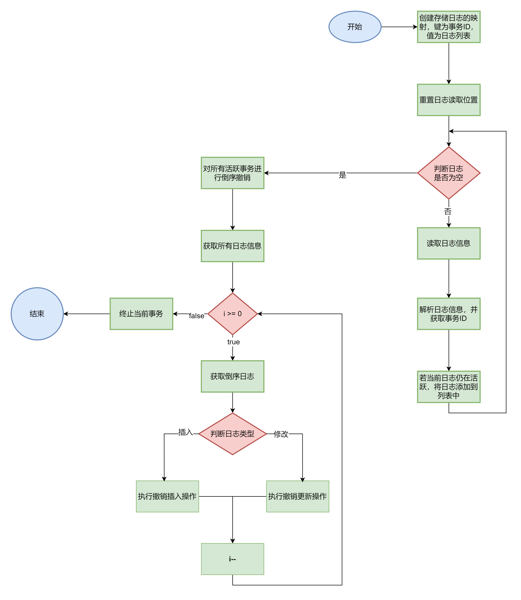

> 本章涉及代码：com/dyx/simpledb/backend/dm/logger；com/dyx/simpledb/backend/dm/Recover.java

## EasyDB 崩溃恢复功能概述

EasyDB 提供了崩溃后的数据恢复功能。为了保证数据的一致性，每当 DM 层对底层数据进行操作时，都会将一条日志记录到磁盘上。在数据库崩溃后，再次启动时，系统可以根据这些日志内容恢复数据文件，从而确保数据的一致性和完整性。

### 日志格式与结构

日志以二进制文件的形式存储，格式如下：

```
[XChecksum][Log1][Log2][Log3]...[LogN][BadTail]
```

- `XChecksum`：四字节的整数，是对后续所有日志计算的校验和。
- `Log1 ~ LogN`：常规的日志数据。
- `BadTail`：数据库崩溃时尚未写完的日志数据（可能不存在）。

每条日志的结构如下：

```
[Size][Checksum][Data]
```

- `Size`：四字节整数，表示 `Data` 段的字节数。
- `Checksum`：四字节整数，记录该条日志的校验和。

### 日志文件的校验和

EasyDB 通过计算日志文件的校验和来确保日志数据的完整性，就是通过一个指定的种子实现的。以下是计算校验和的核心逻辑：

```java
private int calChecksum(int xCheck, byte[] log) {
    for (byte b : log) {
        xCheck = xCheck * SEED + b; // SEED = 13331
    }
    return xCheck;
}
```

### 日志文件的创建与初始化

在创建日志文件时，系统会初始化 `XChecksum` 为 0，并写入文件。打开文件时，系统将读取 `XChecksum` 并检查 `BadTail` 的存在性。

```java
// 日志文件创建时
ByteBuffer buf = ByteBuffer.wrap(Parser.int2Byte(0)); // 初始化 XChecksum 为 0并转换成四字节的数字
try {
    fc.position(0);
    fc.write(buf); //将其写入到文件
    fc.force(false);
} catch (IOException e) {
    Panic.panic(e);
}

// 日志文件打开时
void init() {
    // 读取文件大小和 XChecksum
    size = file.length();
    ByteBuffer raw = ByteBuffer.allocate(4);
    fc.position(0);
    fc.read(raw);
    xChecksum = Parser.parseInt(raw.array());
    checkAndRemoveTail();
}
```

### `checkAndRemoveTail()`

当打开一个日志文件时，系统首先校验 `XChecksum`，并移除可能存在的 `BadTail`。`BadTail` 是因崩溃而未能完整写入的日志数据，它不会包含在日志文件的校验和中，因此需要移除以确保文件一致性。  


```java
// 检查并移除bad tail
private void checkAndRemoveTail() {
    // 将当前位置重置为文件的开始位置
    // [XChecksum][Log1][Log2]...[LogN][BadTail] --> [Log1][Log2]...[LogN][BadTail]
    rewind();
    // 初始化校验和为 0
    int xCheck = 0;
    // 循环读取日志，直到没有更多的日志可以读取
    while (true) {
        // 读取下一条日志
        byte[] log = internNext();

        // 如果读取到的日志为 null，说明没有更多的日志可以读取，跳出循环
        if (log == null) break;

        // 计算校验和
        xCheck = calChecksum(xCheck, log);
    }

    // 比较计算得到的校验和和文件中的校验和，如果不相等，说明日志已经被破坏，抛出异常
    if (xCheck != xChecksum) {
        Panic.panic(Error.BadLogFileException);
    }

    // 尝试将文件截断到当前位置，移除 "bad tail"
    try {
        truncate(position);
    } catch (Exception e) {
        // 如果发生异常，调用 Panic.panic 方法处理异常
        Panic.panic(e);
    }

    // 尝试将文件的读取位置设置为当前位置
    try {
        file.seek(position);
    } catch (IOException e) {
        // 如果发生 IO 异常，调用 Panic.panic 方法处理异常
        Panic.panic(e);
    }

    // 将当前位置重置为文件的开始位置
    rewind();
}
```

### 日志迭代与写入

EasyDB 使用迭代器模式读取日志，通过 `next()` 方法不断获取下一条日志，并解析其中的 `Data` 部分。`internNext()` 函数实现了日志的读取和校验逻辑。

```java
@Override
public byte[] next() {
    lock.lock();
    try {
        byte[] log = internNext();
        if (log == null) return null;
        return Arrays.copyOfRange(log, OF_DATA, log.length);
    } finally {
        lock.unlock();
    }
}
```

流程图看个大概意思即可：  


```java
/**
 * 获取下一条日志
 */
private byte[] internNext() {
    // 检查当前位置是否已经超过了文件的大小，如果超过了，说明没有更多的日志可以读取，返回 null
    if (position + OF_DATA >= fileSize) {
        return null;
    }

    // 创建一个大小为 4 的 ByteBuffer，用于读取日志的大小
    ByteBuffer tmp = ByteBuffer.allocate(4);
    try {
        // 将文件通道的位置设置为当前位置
        fc.position(position);
        // 从文件通道中读取 4 个字节的数据到 ByteBuffer 中，即Size日志文件的大小
        fc.read(tmp);
    } catch (IOException e) {
        // 如果发生 IO 异常，调用 Panic.panic 方法处理异常
        Panic.panic(e);
    }

    // 使用 Parser.parseInt 方法将读取到的 4 个字节的数据转换为 int 类型，得到日志的大小
    int size = Parser.parseInt(tmp.array());

    // 检查当前位置加上日志的大小是否超过了文件的大小，如果超过了，说明日志不完整，返回 null
    if (position + size + OF_DATA > fileSize) {
        return null;
    }

    // 创建一个大小为 OF_DATA + size 的 ByteBuffer，用于读取完整的日志
    ByteBuffer buf = ByteBuffer.allocate(OF_DATA + size);
    try {
        // 将文件通道的位置设置为当前位置
        fc.position(position);
        // 从文件通道中读取 OF_DATA + size 个字节的数据到 ByteBuffer 中
        // 读取整条日志 [Size][Checksum][Data]
        fc.read(buf);
    } catch (IOException e) {
        // 如果发生 IO 异常，调用 Panic.panic 方法处理异常
        Panic.panic(e);
    }

    // 将 ByteBuffer 中的数据转换为字节数组
    byte[] log = buf.array();

    // 计算日志数据的校验和
    int checkSum1 = calChecksum(0, Arrays.copyOfRange(log, OF_DATA, log.length));
    // 从日志中读取校验和
    int checkSum2 = Parser.parseInt(Arrays.copyOfRange(log, OF_CHECKSUM, OF_DATA));

    // 比较计算得到的校验和和日志中的校验和，如果不相等，说明日志已经被破坏，返回 null
    if (checkSum1 != checkSum2) {
        return null;
    }

    // 更新当前位置
    position += log.length;

    // 返回读取到的日志
    return log;
}
```

日志写入时，系统首先将数据封装成日志格式，然后写入文件，并更新总校验和。  


```java
@Override
public void log(byte[] data) {
    // 解析成一条完整的log日志
    byte[] log = wrapLog(data);
    ByteBuffer buf = ByteBuffer.wrap(log);
    lock.lock();
    try {
        //写入到指定位置
        fc.position(fc.size());
        fc.write(buf);
    } catch (IOException e) {
        Panic.panic(e);
    } finally {
        lock.unlock();
    }
    // 更新总校验值
    updateXChecksum(log);
}

/**
 * 更新总校验值
 */
private void updateXChecksum(byte[] log) {
    //计算总校验值
    this.xChecksum = calChecksum(this.xChecksum, log);
    try {
        fc.position(0);
        fc.write(ByteBuffer.wrap(Parser.int2Byte(xChecksum)));
        fc.force(false);
    } catch (IOException e) {
        Panic.panic(e);
    }
}

/**
* 将数据解析成完整log
*/
private byte[] wrapLog(byte[] data) {
    // 使用 calChecksum 方法计算数据的校验和，然后将校验和转换为字节数组
    byte[] checksum = Parser.int2Byte(calChecksum(0, data));
    // 将数据的长度转换为字节数组
    byte[] size = Parser.int2Byte(data.length);
    // 使用 Bytes.concat 方法将 size、checksum 和 data 连接成一个新的字节数组，然后返回这个字节数组
    return Bytes.concat(size, checksum, data);
}
```

### EasyDB 恢复策略详解

在 EasyDB 中，恢复策略是从 NYADB2 借鉴而来的，其核心是通过严格的日志管理和操作规则来确保数据库在崩溃后的数据一致性。这个策略涉及对数据库操作的日志记录，并依赖于日志的重做（redo）和撤销（undo）机制来恢复数据。

#### 恢复策略的基本原理

EasyDB 为上层模块（DM 层）提供了两种基本的操作：**插入新数据（Insert, I）和更新现有数据（Update, U）**。在进行任何数据操作之前，必须先进行对应的日志操作，确保日志已经写入磁盘后才开始实际的数据操作。这样的设计保证了即使在数据操作还未完成的情况下发生崩溃，系统仍可以通过日志恢复数据。
**日志记录格式**：

- `(Ti, I, A, x)`：表示事务 `Ti` 在位置 `A` 插入了数据 `x`。
- `(Ti, U, A, oldx, newx)`：表示事务 `Ti` 将位置 `A` 的数据从 `oldx` 更新为 `newx`。

#### 单线程环境下的恢复

在单线程环境中，只可能有一个事务在操作数据库。日志不会相互交错，因此恢复过程较为简单。

- **重做（redo）**：
  - 正序扫描事务 `T` 的所有日志。
  - 如果日志是插入操作 `(Ti, I, A, x)`，将 `x` 重新插入位置 `A`。
  - 如果日志是更新操作 `(Ti, U, A, oldx, newx)`，将位置 `A` 的值更新为 `newx`。
- **撤销（undo）**：
  - 倒序扫描事务 `T` 的所有日志。
  - 如果日志是插入操作 `(Ti, I, A, x)`，将位置 `A` 的数据标记为无效（逻辑删除）。
  - 如果日志是更新操作 `(Ti, U, A, oldx, newx)`，将位置 `A` 的值恢复为 `oldx`。

**案例讲解**：
假设在一个单线程环境中，有如下事务操作：

- 事务 `T1` 插入了数据 `x` 到位置 `A`，日志记录为 `(T1, I, A, x)`。
- 事务 `T1` 还更新了位置 `B` 的数据，将其从 `oldB` 更新为 `newB`，日志记录为 `(T1, U, B, oldB, newB)`。

在系统崩溃后，恢复过程将：

1. 正序重做 `T1` 的插入操作，将 `x` 重新插入位置 `A`。
2. 重做 `T1` 的更新操作，将位置 `B` 的数据更新为 `newB`。

如果 `T1` 在崩溃前未完成，恢复过程将撤销这些操作，将 `A` 中的 `x` 标记为无效，并将 `B` 的数据恢复为 `oldB`。

#### 多线程环境下的恢复

在多线程环境中，多个事务可能并发执行，恢复过程的复杂性增加。为了确保数据的一致性，EasyDB 引入了以下两条规则：

- **规则 1**：正在进行的事务不得读取任何未提交的事务产生的数据。
  - 该规则避免了级联回滚的问题，即一个已提交的事务读取了未提交事务的数据，而该未提交事务在崩溃后被撤销时，已提交事务的更改也必须被撤销。
- **规则 2**：正在进行的事务不得修改其他任何未提交的事务修改或产生的数据。
  - 该规则避免了在多线程环境中多个事务相互干扰，导致数据不一致的问题。

**案例讲解**：

1. **案例 1：避免级联回滚**

假设有两个并发事务 `T1` 和 `T2`：

   - `T1` 读取了 `T2` 更新后的数据 `x`。
   - `T2` 尚未提交，系统崩溃。

在恢复过程中，`T2` 的操作被撤销，而由于 `T1` 读取了 `T2` 的未提交数据，`T1` 也需要被撤销。然而，由于 `T1` 已提交，撤销它会导致数据不一致。因此，通过规则 1，EasyDB 保证 `T1` 不会读取 `T2` 的未提交数据，从而避免这种问题。

2. **案例 2：避免数据不一致**

假设事务 `T1` 和 `T2` 并发更新同一数据 `x`：

   - `T1` 将 `x` 从 `0` 更新为 `1`。
   - `T2` 将 `x` 从 `1` 更新为 `2`，并提交。
   - 系统崩溃。

在恢复过程中，如果先撤销 `T1`，再重做 `T2`，`x` 的最终值为 `2`。但如果顺序相反，`x` 的最终值可能为 `0`。通过规则 2，EasyDB 保证 `T2` 的更新不会基于 `T1` 的未提交数据，从而避免数据不一致的问题。

#### 恢复策略的具体实现代码

##### 日志格式

EasyDB 中的日志分为两种类型，分别对应插入操作和更新操作：

```java
public class Recover {
    private static final byte LOG_TYPE_INSERT = 0;
    private static final byte LOG_TYPE_UPDATE = 1;

    // updateLog:
    // [LogType] [XID] [UID] [OldRaw] [NewRaw]
    
    // insertLog:
    // [LogType] [XID] [Pgno] [Offset] [Raw]
}
```

##### 重做已完成的事务

重做操作通过扫描所有日志记录，重做所有已完成的事务操作。  


```java
private static void redoTranscations(TransactionManager tm, Logger lg, PageCache pc) {
    // 重置日志文件的读取位置到开始
    lg.rewind();
    // 循环读取日志文件中的所有日志记录
    while (true) {
        // 读取下一条日志记录
        byte[] log = lg.next();
        // 如果读取到的日志记录为空，表示已经读取到日志文件的末尾，跳出循环
        if (log == null) break;
        // 判断日志记录的类型
        if (isInsertLog(log)) {
            // 如果是插入日志，解析日志记录，获取插入日志信息
            InsertLogInfo li = parseInsertLog(log);
            // 获取事务ID
            long xid = li.xid;
            // 如果当前事务已经提交，进行重做操作
            if (!tm.isActive(xid)) {
                doInsertLog(pc, log, REDO);
            }
        } else {
            // 如果是更新日志，解析日志记录，获取更新日志信息
            UpdateLogInfo xi = parseUpdateLog(log);
            // 获取事务ID
            long xid = xi.xid;
            // 如果当前事务已经提交，进行重做操作
            if (!tm.isActive(xid)) {
                doUpdateLog(pc, log, REDO);
            }
        }
    }
}

```

##### 撤销未完成的事务

撤销操作通过倒序扫描日志记录，撤销所有未完成的事务操作。  


```java
private static void undoTranscations(TransactionManager tm, Logger lg, PageCache pc) {
    // 创建一个用于存储日志的映射，键为事务ID，值为日志列表
    Map<Long, List<byte[]>> logCache = new HashMap<>();
    // 将日志文件的读取位置重置到开始
    lg.rewind();
    // 循环读取日志文件中的所有日志记录
    while (true) {
        // 读取下一条日志记录
        byte[] log = lg.next();
        // 如果读取到的日志记录为空，表示已经读取到日志文件的末尾，跳出循环
        if (log == null) break;
        // 判断日志记录的类型
        if (isInsertLog(log)) {
            // 如果是插入日志，解析日志记录，获取插入日志信息
            InsertLogInfo li = parseInsertLog(log);
            // 获取事务ID
            long xid = li.xid;
            // 如果当前事务仍然活跃，将日志记录添加到对应的日志列表中
            if (tm.isActive(xid)) {
                if (!logCache.containsKey(xid)) {
                    logCache.put(xid, new ArrayList<>());
                }
                logCache.get(xid).add(log);
            }
        } else {
            // 如果是更新日志，解析日志记录，获取更新日志信息
            UpdateLogInfo xi = parseUpdateLog(log);
            // 获取事务ID
            long xid = xi.xid;
            // 如果当前事务仍然活跃，将日志记录添加到对应的日志列表中
            if (tm.isActive(xid)) {
                if (!logCache.containsKey(xid)) {
                    logCache.put(xid, new ArrayList<>());
                }
                // 将事务id对应的log添加到集合中
                logCache.get(xid).add(log);
            }
        }
    }

    // 对所有活跃的事务的日志进行倒序撤销
    for (Entry<Long, List<byte[]>> entry : logCache.entrySet()) {
        List<byte[]> logs = entry.getValue();
        for (int i = logs.size() - 1; i >= 0; i--) {
            byte[] log = logs.get(i);
            // 判断日志记录的类型
            if (isInsertLog(log)) {
                // 如果是插入日志，进行撤销插入操作
                doInsertLog(pc, log, UNDO);
            } else {
                // 如果是更新日志，进行撤销更新操作
                doUpdateLog(pc, log, UNDO);
            }
        }
        // 中止当前事务
        tm.abort(entry.getKey());
    }
}
```

##### 插入和更新日志的操作实现  


```java
private static void doInsertLog(PageCache pc, byte[] log, int flag) {
    InsertLogInfo li = parseInsertLog(log);
    Page pg = null;
    try {
        pg = pc.getPage(li.pgno);
    } catch(Exception e) {
        Panic.panic(e);
    }
    try {
        if(flag == UNDO) {
            DataItem.setDataItemRawInvalid(li.raw);
        }
        PageX.recoverInsert(pg, li.raw, li.offset);
    } finally {
        pg.release();
    }
}

private static void doUpdateLog(PageCache pc, byte[] log, int flag) {
    int pgno;
    short offset;
    byte[] raw;
    if(flag == REDO) {
        UpdateLogInfo xi = parseUpdateLog(log);
        pgno = xi.pgno;
        offset = xi.offset;
        raw = xi.newRaw;
    } else {
        UpdateLogInfo xi = parseUpdateLog(log);
        pgno = xi.pgno;
        offset = xi.offset;
        raw = xi.oldRaw;
    }
    Page pg = null;
    try {
        pg = pc.getPage(pgno);
    } catch (Exception e) {
        Panic.panic(e);
    }
    try {
        PageX.recoverUpdate(pg, raw, offset);
    } finally {
        pg.release();
    }
}
```

以上的代码实现了 EasyDB 中的恢复策略，通过对日志的管理和恢复规则的严格遵守，确保数据库在单线程和多线程环境下的可靠性和一致性。
:::tip
**本文作者：**[blockCloth](https://github.com/blockCloth)  
**部分内容转载自：**[https://shinya.click/projects/mydb/mydb4](https://shinya.click/projects/mydb/mydb4)  
**版权声明：** 本博客所有文章除特别声明外，均采用 [CC BY-NC-SA 4.0](https://creativecommons.org/licenses/by/4.0/legalcode.zh-hans)许可协议。转载请注明来自 [blockCloth](https://github.com/blockCloth)
:::