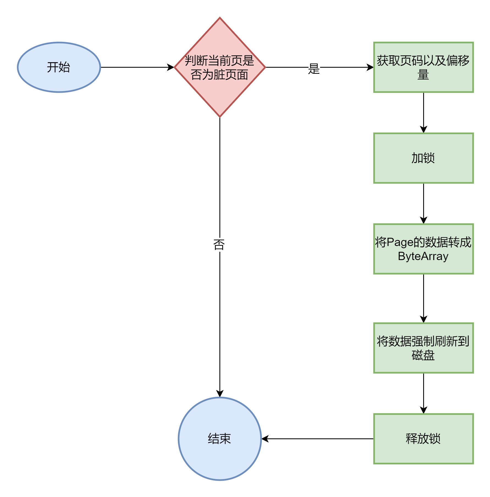
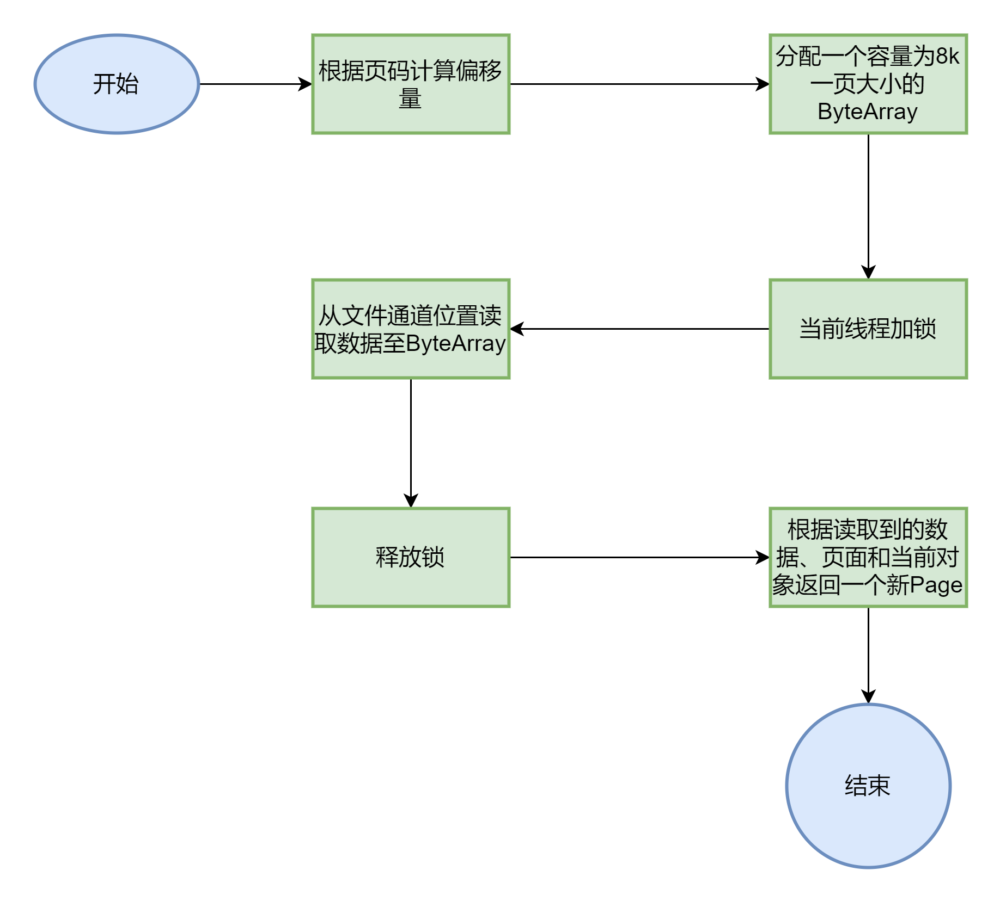
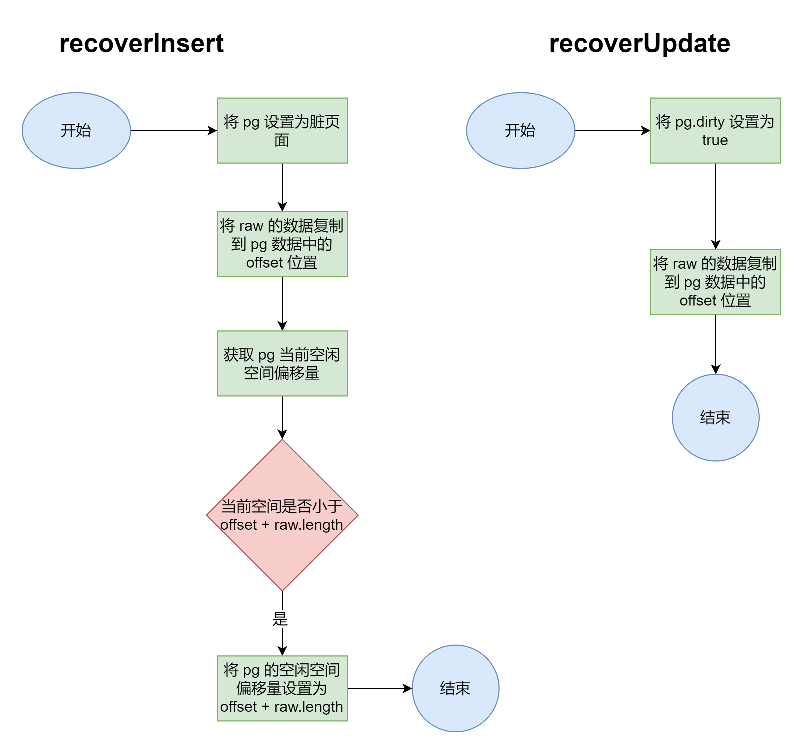

> 本章涉及代码：com/dyx/simpledb/backend/dm/pageCache/*

### 页面缓存设计与实现

在数据库系统中，页面缓存是为了提升读写效率而设计的一种缓存机制。通过将页面数据保存在内存中，可以减少频繁的磁盘 I/O 操作，从而提高系统的整体性能。这里参考大部分数据库的设计，将默认数据页大小定为 8K。如果想要提升向数据库写入大量数据情况下的性能，也可以适当增大这个值。
通过前面的内容我们已经实现了一个通用的缓存框架，而在本节中，我们将借助这个缓存框架来实现页面缓存。不过首先，需要定义出页面的结构。需要注意的是，页面结构是存储在内存中的，与已经持久化到磁盘的抽象页面有一定的区别。

#### 页面结构定义

页面（`Page`）是数据库中存储数据的基本单元，其结构如下：

- `pageNumber`：页面的页号，从**1**开始计数。
- `data`：页面实际包含的字节数据。
- `dirty`：标志页面是否是脏页面。脏页面在缓存驱逐时需要被写回到磁盘。
- `lock`：用于保证页面操作的线程安全。
- `PageCache`：引用页面缓存，便于在获取页面时快速释放页面的缓存操作。

```java
public class PageImpl implements Page {
    private int pageNumber;
    private byte[] data;
    private boolean dirty;
    private Lock lock;
    private PageCache pc;
}
```

#### 页面缓存接口定义

- 定义了页面缓存的接口，包括新建页面、获取页面、释放页面、关闭缓存、根据最大页号截断缓存、获取当前页面数量以及刷新页面等方法。

```java
public interface PageCache {
    int newPage(byte[] initData);
    Page getPage(int pgno) throws Exception;
    void close();
    void release(Page page);
    void truncateByBgno(int maxPgno);
    int getPageNumber();
    void flushPage(Page pg);
}
```

#### 页面缓存的实现

页面缓存的具体实现类继承了抽象缓存框架，并实现了 `getForCache()` 和 `releaseForCache()` 两个方法：

- `getForCache()`：用于从文件中读取页面数据，并将其包装成 `Page` 对象。
- `releaseForCache()`：用于在驱逐页面时根据页面是否为脏页面，决定是否将其写回文件系统。

#### 页面写回文件系统

当页面缓存决定驱逐某个页面时，如果该页面是脏页面，则需要将其数据写回到磁盘。这个操作通过 `flush()` 方法实现，确保数据的原子性和线程安全性。  


```java
@Override
protected void releaseForCache(Page pg) {
    if (pg.isDirty()) {
        flush(pg);
        pg.setDirty(false);
    }
}

 private void flush(Page pg) {
    int pgno = pg.getPageNumber(); // 获取Page的页码
    long offset = pageOffset(pgno); // 计算Page在文件中的偏移量

    fileLock.lock(); // 加锁，确保线程安全
    try {
        ByteBuffer buf = ByteBuffer.wrap(pg.getData()); // 将Page的数据包装成ByteBuffer
        fc.position(offset); // 设置文件通道的位置
        fc.write(buf); // 将数据写入到文件中
        fc.force(false); // 强制将数据从操作系统的缓存刷新到磁盘
    } catch (IOException e) {
        Panic.panic(e); // 如果发生异常，调用Panic.panic方法处理
    } finally {
        fileLock.unlock(); // 最后，无论是否发生异常，都要解锁
    }
}
```

#### 新建页面

新建页面时，页面缓存会自增页面数量，并在写入文件系统后返回新建页面的页号。页面数据一旦创建就会立刻写入磁盘，以确保数据的持久性。

```java
public int newPage(byte[] initData) {
    int pgno = pageNumbers.incrementAndGet();
    Page pg = new PageImpl(pgno, initData, null);
    flush(pg);  // 新建的页面需要立刻写回
    return pgno;
}
```

#### 限制条件

数据库系统中，不允许单条数据跨页存储，即每条数据的大小不能超过单个页面的大小。

### 页面缓存的操作方法

#### `getForCache()`

`getForCache()` 方法通过读取数据库文件中的页面数据，并将其包装成 `Page` 对象返回。这一过程确保了从磁盘读取数据的正确性和线程安全性。  


```java
/**
 * 根据pageNumber从数据库文件中读取页数据，并包裹成Page
 */
@Override
protected Page getForCache(long key) throws Exception {
    // 将key转换为页码
    int pgno = (int) key;
    // 计算页码对应的偏移量
    long offset = PageCacheImpl.pageOffset(pgno);

    // 分配一个大小为PAGE_SIZE的ByteBuffer
    ByteBuffer buf = ByteBuffer.allocate(PAGE_SIZE);
    // 锁定文件，确保线程安全
    fileLock.lock();
    try {
        // 设置文件通道的位置为计算出的偏移量
        fc.position(offset);
        // 从文件通道读取数据到ByteBuffer
        fc.read(buf);
    } catch (IOException e) {
        // 如果发生异常，调用Panic.panic方法处理
        Panic.panic(e);
    }
    // 无论是否发生异常，都要解锁
    fileLock.unlock();
    // 使用读取到的数据、页码和当前对象创建一个新的PageImpl对象并返回
    return new PageImpl(pgno, buf.array(), this);
}

public PageImpl(int pageNumber, byte[] data, PageCache pc) {
    this.pageNumber = pageNumber; // 设置页面的页号
    this.data = data; // 设置页面实际包含的字节数据
    this.pc = pc; // 设置页面缓存
    lock = new ReentrantLock(); // 初始化一个新的可重入锁
}
```

#### `releaseForCache()`

当页面不再需要时，`releaseForCache()` 方法会检查页面是否是脏页面，并根据需要将页面的数据写回到磁盘。如果页面被标记为脏页面（即其数据已被修改但尚未写回磁盘），则需要通过 `flush()` 方法将其内容写入磁盘。

```java
@Override
protected void releaseForCache(Page pg) {
    if (pg.isDirty()) {
        flush(pg);
        pg.setDirty(false);
    }
}
```

### 数据恢复操作

在数据库系统中，数据恢复操作是为了确保在系统崩溃后，能够从日志或其他持久化存储中恢复数据。`recoverInsert()` 和 `recoverUpdate()` 方法用于在数据库崩溃后重新插入数据和恢复修改。

- `recoverInsert()`：将数据插入到指定的偏移位置，并更新空闲空间的偏移量。
- `recoverUpdate()`：在指定的偏移位置直接更新数据，而不更新空闲空间的偏移量。  


```java
// 将raw插入pg中的offset位置，并将pg的offset设置为较大的offset
public static void recoverInsert(Page pg, byte[] raw, short offset) {
    pg.setDirty(true); // 将pg的dirty标志设置为true，表示pg的数据已经被修改
    System.arraycopy(raw, 0, pg.getData(), offset, raw.length); // 将raw的数据复制到pg的数据中的offset位置

    short rawFSO = getFSO(pg.getData()); // 获取pg的当前空闲空间偏移量
    if (rawFSO < offset + raw.length) { // 如果当前的空闲空间偏移量小于offset + raw.length
        setFSO(pg.getData(), (short) (offset + raw.length)); // 将pg的空闲空间偏移量设置为offset + raw.length
    }
}

// 将raw插入pg中的offset位置，不更新update
public static void recoverUpdate(Page pg, byte[] raw, short offset) {
    pg.setDirty(true); // 将pg的dirty标志设置为true，表示pg的数据已经被修改
    System.arraycopy(raw, 0, pg.getData(), offset, raw.length); // 将raw的数据复制到pg的数据中的offset位置
}
```

### 总结

页面缓存的设计和实现对于提升数据库系统的读写性能至关重要。通过页面缓存机制，系统可以减少不必要的磁盘 I/O 操作，同时保证数据的一致性和可靠性。在数据恢复方面，通过 `recoverInsert()` 和 `recoverUpdate()` 方法，系统可以在发生崩溃后有效地恢复数据，确保数据的完整性。
:::tip
**本文作者：**[blockCloth](https://github.com/blockCloth)  
**部分内容转载自：**[https://shinya.click/projects/mydb/mydb3](https://shinya.click/projects/mydb/mydb3)  
**版权声明：** 本博客所有文章除特别声明外，均采用 [CC BY-NC-SA 4.0](https://creativecommons.org/licenses/by/4.0/legalcode.zh-hans)许可协议。转载请注明来自 [blockCloth](https://github.com/blockCloth)
:::