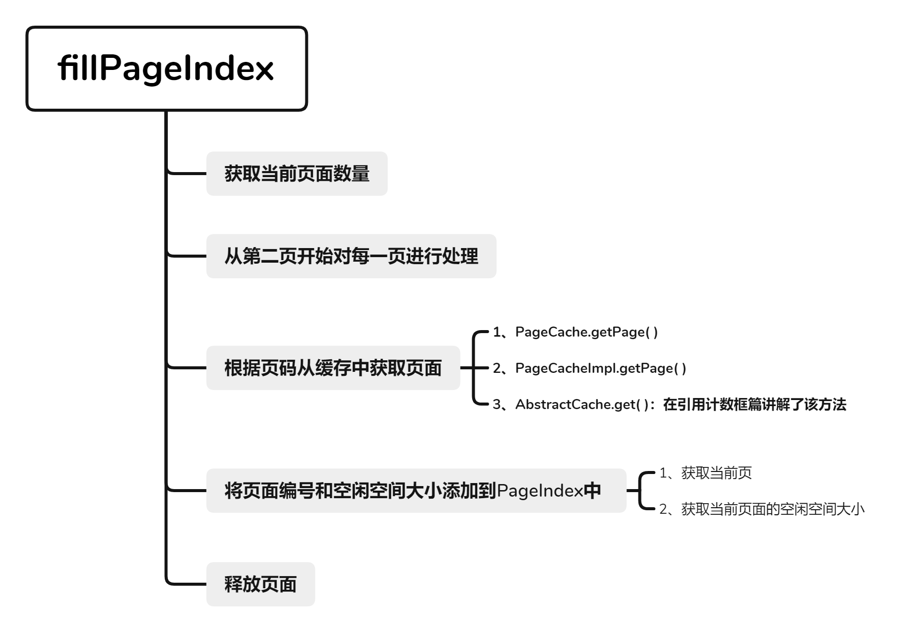

> 本章涉及代码：com/dyx/simpledb/backend/dm/pageIndex/*

### 页面索引设计与实现

在数据库系统中，为了提高插入操作的效率，页面索引的设计应运而生。它的主要作用是缓存每个页面的空闲空间信息，从而在插入数据时，能够快速找到一个合适的页面，而无需遍历所有的页面。

#### 页面索引的基本介绍

页面索引通过将每个页面划分为一定数量的区间（在这个设计中，划分为40个区间），并在数据库启动时遍历所有页面，将每个页面的空闲空间信息分配到相应的区间中。
当进行插入操作时，首先根据所需的空间大小向上取整，映射到某一个区间，然后直接从该区间中选择一个页面，以满足插入需求。页面索引的实现通过一个数组来存储这些信息，数组中的每个元素都是一个列表，包含具有相同空闲空间大小的页面信息。
被选择的页面从页面索引中移除，这样可以避免同一个页面的并发写入。在上层模块使用完页面后，必须将其重新插入页面索引，以便其他插入操作可以继续使用。
总的来说，页面索引通过缓存页面的空闲空间信息，有效避免了频繁的磁盘访问，从而加速了插入操作的执行。

#### `PageIndex` 类的实现

```java
public class PageIndex {
    // 将每一页划分为40个区间
    private static final int INTERVALS_NO = 40;
    private static final int THRESHOLD = PageCache.PAGE_SIZE / INTERVALS_NO; // 每个区间大小为204字节

    private Lock lock;
    // 每个区间存储的页面信息
    private List<PageInfo>[] lists = new List[INTERVALS_NO + 1];
}
```

#### 根据空间大小选择页面：`select(int spaceSize)`

`select()` 方法根据需要的空间大小，计算对应的区间编号，并从 `PageIndex` 中获取一个合适的页面。

```java
public PageInfo select(int spaceSize) {
    lock.lock(); // 获取锁，确保线程安全
    try {
        int number = spaceSize / THRESHOLD; // 计算对应的区间编号
        if (number < INTERVALS_NO) number++; // 向上取整，以确保找到足够大的空间
        while (number <= INTERVALS_NO) { // 从当前区间向上查找
            if (lists[number].size() == 0) { // 当前区间没有可用页面，继续查找下一个区间
                number++;
                continue;
            }
            return lists[number].remove(0); // 返回并移除找到的页面信息
        }
        return null; // 没有找到合适的页面，返回 null
    } finally {
        lock.unlock(); // 释放锁
    }
}
```

#### 添加页面信息：`add(int pgno, int freeSpace)`

`add()` 方法用于在上层模块使用完页面后，将页面重新插入 `PageIndex`，以便后续插入操作可以继续使用该页面。

```java
public void add(int pgno, int freeSpace) {
    lock.lock(); // 获取锁，确保线程安全
    try {
        int number = freeSpace / THRESHOLD; // 计算空闲空间对应的区间编号
        lists[number].add(new PageInfo(pgno, freeSpace)); // 将页面信息添加到对应的区间列表中
    } finally {
        lock.unlock(); // 释放锁
    }
}
```

#### 填充页面索引：`fillPageIndex()`

`fillPageIndex()` 方法在 `DataManager` 被创建时调用，它遍历所有页面，从第二页开始，将每个页面的空闲空间信息填充到 `PageIndex` 中。  


```java
void fillPageIndex() {
    int pageNumber = pc.getPageNumber(); // 获取当前页面数量
    for (int i = 2; i <= pageNumber; i++) { // 从第二页开始处理每个页面
        Page pg = null;
        try {
            pg = pc.getPage(i); // 获取页面
        } catch (Exception e) {
            Panic.panic(e); // 处理异常
        }
        pIndex.add(pg.getPageNumber(), PageX.getFreeSpace(pg)); // 将页面编号和空闲空间大小添加到 PageIndex
        pg.release(); // 释放页面
    }
}
```

### 总结

页面索引通过缓存页面的空闲空间信息，显著提高了数据库插入操作的效率。在进行插入操作时，可以快速找到一个合适的页面，而无需遍历磁盘或缓存中的所有页面。通过实现 `PageIndex` 类以及相关方法，数据库系统在处理大量插入操作时表现得更加高效，减少了磁盘访问次数，优化了系统性能。
:::note
**本文作者：**[blockCloth](https://github.com/blockCloth)  
**部分内容转载自：**[https://shinya.click/projects/mydb/mydb5](https://shinya.click/projects/mydb/mydb5)  
**版权声明：** 本博客所有文章除特别声明外，均采用 [CC BY-NC-SA 4.0](https://creativecommons.org/licenses/by/4.0/legalcode.zh-hans)许可协议。转载请注明来自 [blockCloth](https://github.com/blockCloth)
:::