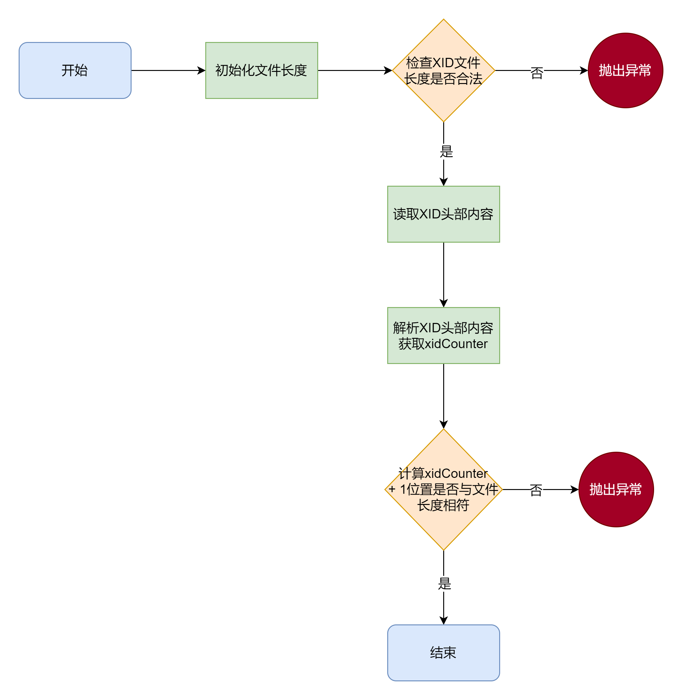

> 本章涉及代码：com/dyx/simpledb/backend/tm/*

假如你是一名负责管理重要文档的管理员。每份文档都代表着一项关键任务（事务），你的职责是确保这些任务被准确记录、顺利执行，并最终完成。如果任务顺利完成，你需要提交文档以确认其状态；而如果在执行过程中出现问题，你则需要将文档恢复到最初状态，也就是进行回滚。你的工具就是这篇教程中的 TransactionManager，它就像是你的任务调度器，帮助你实时跟踪和管理每个任务的状态，确保任务按计划进行或及时处理任何异常情况。
## XID文件结构以及规则
> TM 是通过维护 XID 文件来维护事务的状态的，并提供接口供其他模块来查询某个事务的状态，下面就来介绍一下 XID 文件

我们可以把 **XID** 文件比喻成一个任务清单，每个事务都有一个独特的编号（XID），就像每个任务在清单上都有它的专属编号。`TransactionManager` 就像是一位任务管理员，通过这个清单，它可以随时知道哪些任务正在进行（`active`），哪些已经完成（`committed`），哪些被取消（`aborted`）。  
### XID 的定义
- **事务标识符（XID）：**
   - 每个事务都有一个唯一的事务标识符 XID，从 1 开始递增。
   - `XID 0 `被特殊定义为超级事务（Super Transaction），用于表示在没有申请事务的情况下进行的操作，其状态永远是`committed`

### 事务的状态
- **三种状态**：
   - `active`：正在进行，尚未结束。
   - `committed`：已提交。
   - `aborted`：已撤销或回滚。
### XID 文件的结构和管理
- **TransactionManager 的职责**：
   - 维护一个 XID 格式的文件，用于记录各个事务的状态。
   - 每个事务在 XID 文件中分配一个字节的空间，用于保存其状态。
   - XID 文件的头部保存一个 8 字节的数字，用于记录这个 XID 文件管理的事务的个数。
   - 事务 XID 在文件中的状态存储在 `(XID-1) + 8` 字节的位置处（因为 XID 0 不需要记录状态）。
## TransactionManager 的接口定义

- `begin()`：开启事务。
- `commit(long xid)`：提交事务。
- `abort(long xid)`：撤销或回滚事务。
- `isActive(long xid)`：查询一个事务的状态是否正在运行。
- `isCommitted(long xid)`：查询一个事务的状态是否已经提交。
- `isAborted(long xid)`：查询一个事务的状态是否撤销或回滚。
- `close()`：关闭事务。
```java
public interface TransactionManager {
    long begin();                       // 开启一个新事务
    void commit(long xid);              // 提交一个事务
    void abort(long xid);               // 取消一个事务
    boolean isActive(long xid);         // 查询一个事务的状态是否是正在进行的状态
    boolean isCommitted(long xid);      // 查询一个事务的状态是否是已提交
    boolean isAborted(long xid);        // 查询一个事务的状态是否是已取消
    void close();                       // 关闭TM
}
```
## TM模块的实现
### 常量定义
```java
public class TransactionManagerImpl implements TransactionManager {
    // XID文件头长度
    static final int LEN_XID_HEADER_LENGTH = 8;
    // 每个事务的占用长度
    private static final int XID_FIELD_SIZE = 1;

    // 事务的三种状态
    private static final byte FIELD_TRAN_ACTIVE = 0;
    private static final byte FIELD_TRAN_COMMITTED = 1;
    private static final byte FIELD_TRAN_ABORTED = 2;

    // 超级事务，永远为commited状态
    public static final long SUPER_XID = 0;

    // XID文件后缀
    static final String XID_SUFFIX = ".xid";
}
```
### XID文件的校验与读取

#### 校验XID文件
在创建 `TransactionManager`的构造函数后，首先需要对 XID 文件进行校验，以确保其合法性。校验过程相对简单，通过读取文件头的 8 字节数字推算出文件的理论长度，并将其与实际长度进行对比。如果两者不一致，则认为该 XID 文件存在问题，不符合规范。对于校验未通过的情况，系统会立即触发 panic 方法，强制终止运行。在一些关键基础模块中，一旦发生无法恢复的错误，系统会直接停机，以确保整体系统的安全性和稳定性。



```java
private void checkXIDCounter() {
    // 初始化文件长度为0
    long fileLen = 0;
    try {
        fileLen = file.length();
    } catch (IOException e1) {
        Panic.panic(Error.BadXIDFileException);
    }

    // 如果文件长度小于XID头部长度，抛出异常
    if (fileLen < LEN_XID_HEADER_LENGTH) {
        Panic.panic(Error.BadXIDFileException);
    }

    ByteBuffer buf = ByteBuffer.allocate(LEN_XID_HEADER_LENGTH);
    try {
        fc.position(0);
        fc.read(buf);
    } catch (IOException e) {
        Panic.panic(e);
    }
    this.xidCounter = Parser.parseLong(buf.array());
    long end = getXidPosition(this.xidCounter + 1);
    if (end != fileLen) {
        Panic.panic(Error.BadXIDFileException);
    }
}
```
#### 获取XID位置

- 根据事务xid取得其在xid文件中对应的位置
```java
private long getXidPosition(long xid) {
    return LEN_XID_HEADER_LENGTH + (xid - 1) * XID_FIELD_SIZE;
}
```
### 事务的开始与状态更新
#### 开始一个事务（begin）
想象一下，当你在任务清单上新增一个任务时，你需要先给它分配一个编号，并标记为“进行中”。`begin()` 方法就做了这样的工作：它先为事务分配一个新的 XID，然后标记它为“进行中”，最后把这个信息写入你的任务清单中，并保存起来。这个过程确保每个新任务都有一个独一无二的标识符，并且其状态被准确记录下来，使得你可以随时跟踪和管理任务的进展。这就像是在项目管理中为每个新任务建立一个详细的记录，确保任务按计划进行，防止遗漏或混淆。  
```java
public long begin() {
    counterLock.lock();
    try {
        long xid = xidCounter + 1;
        updateXID(xid, FIELD_TRAN_ACTIVE);
        incrXIDCounter();
        return xid;
    } finally {
        counterLock.unlock();
    }
}
```
#### 更新事务状态（updateXID）
更新事务 `ID` 的状态，可以通过 `updateXID()` 方法来实现，而 `commit()` 和 `abort()` 方法则可以直接调用 `updateXID()`方法来完成任务的提交或回滚操作。这就像是你在任务清单中更新任务的状态：当一个任务完成时（类似于 `commit()`），你会将其标记为“已完成”；而当任务被取消时（类似于 `abort()`），你会将其标记为“已取消”。无论是完成还是取消，都可以通过同一个操作（即 `updateXID()`）来更新任务的状态，确保任务的最终状态被准确记录。
```java
// 更新xid事务的状态为status
private void updateXID(long xid, byte status) {
    // 获取事务xid在xid文件中对应的位置
    long offset = getXidPosition(xid);
    // 创建一个长度为XID_FIELD_SIZE的字节数组
    byte[] tmp = new byte[XID_FIELD_SIZE];
    // 将事务状态设置为status
    tmp[0] = status;
    // 使用字节数组创建一个ByteBuffer
    ByteBuffer buf = ByteBuffer.wrap(tmp);
    try {
        // 将文件通道的位置设置为offset
        fc.position(offset);
        // 将ByteBuffer中的数据写入到文件通道
        fc.write(buf);
    } catch (IOException e) {
        // 如果出现异常，调用Panic.panic方法处理
        Panic.panic(e);
    }
    try {
        // 强制将文件通道中的所有未写入的数据写入到磁盘
        fc.force(false);
    } catch (IOException e) {
        // 如果出现异常，调用Panic.panic方法处理
        Panic.panic(e);
    }
}
```
#### 增加事务计数（incrXIDCounter）
```java
// 将XID加一，并更新XID Header
private void incrXIDCounter() {
    // 事务总数加一
    xidCounter++;
    // 将新的事务总数转换为字节数组，并用ByteBuffer包装
    ByteBuffer buf = ByteBuffer.wrap(Parser.long2Byte(xidCounter));
    try {
        // 将文件通道的位置设置为0，即文件的开始位置
        fc.position(0);
        // 将ByteBuffer中的数据写入到文件通道，即更新了XID文件的头部信息
        fc.write(buf);
    } catch (IOException e) {
        // 如果出现异常，调用Panic.panic方法处理
        Panic.panic(e);
    }
    try {
        // 强制将文件通道中的所有未写入的数据写入到磁盘
        fc.force(false);
    } catch (IOException e) {
        // 如果出现异常，调用Panic.panic方法处理
        Panic.panic(e);
    }
}
```
### 事务状态检查与关闭
#### 检查事务状态（checkXID）
`isActive()、isCommitted()`和 `isAborted()` 都是检查一个 **xid** 的状态
```java
// 定义一个方法，接收一个事务ID（xid）和一个状态（status）作为参数
private boolean checkXID(long xid, byte status) {
    // 计算事务ID在XID文件中的位置
    long offset = getXidPosition(xid);
    // 创建一个新的字节缓冲区（ByteBuffer），长度为XID_FIELD_SIZE
    ByteBuffer buf = ByteBuffer.wrap(new byte[XID_FIELD_SIZE]);
    try {
        // 将文件通道的位置设置为offset
        fc.position(offset);
        // 从文件通道读取数据到字节缓冲区
        fc.read(buf);
    } catch (IOException e) {
        // 如果出现异常，调用Panic.panic方法处理
        Panic.panic(e);
    }
    // 检查字节缓冲区的第一个字节是否等于给定的状态
    // 如果等于，返回true，否则返回false
    return buf.array()[0] == status;
}
```
#### 关闭事务管理器
```java
public void close() {
    try {
        fc.close();
        file.close();
    } catch (IOException e) {
        Panic.panic(e);
    }
}
```

---

## 4. 总结
TM 模块的主要功能是 **管理事务**，包括事务的开始、提交、回滚以及状态检查。为实现这些功能，模块中定义了一系列关键常量，如 `LEN_XID_HEADER_LENGTH`、`XID_FIELD_SIZE`、`FIELD_TRAN_ACTIVE`、`FIELD_TRAN_COMMITTED`、`FIELD_TRAN_ABORTED`、`SUPER_XID` 和 `XID_SUFFIX`，分别表示 XID 文件头长度、每个事务的占用长度、事务的三种状态、超级事务标识以及 XID 文件的后缀。
在实现上，TM 模块通过 `RandomAccessFile` 类型的 `file` 和 `FileChannel` 类型的 `fc` 操作 XID 文件，并使用 `xidCounter` 来记录事务的数量，同时通过 `Lock` 类确保线程安全。构造函数中，首先对 `file` 和 `fc` 进行初始化，并调用 `checkXIDCounter` 方法校验 XID 文件的合法性，确保文件的正确性。
在事务管理方面，`begin()` 方法用于开始一个新事务，通过调用 `updateXID()` 方法将事务 ID 和状态写入 XID 文件，并通过 `incrXIDCounter()` 方法更新 XID 计数器。`commit()` 和 `abort()` 方法分别用于提交和回滚事务，依赖 `updateXID()` 方法来更新事务状态。`isActive()`、`isCommitted()` 和 `isAborted()` 方法用于检查事务状态，通过 `checkXID()` 方法确认事务的当前状态。`close()` 方法则负责关闭文件通道和文件，确保资源的正确释放。
:::tip
**本文作者：**[blockCloth](https://github.com/blockCloth)  
**部分内容转载自：**[https://shinya.click/projects/mydb/mydb1](https://shinya.click/projects/mydb/mydb1)  
**版权声明：** 本博客所有文章除特别声明外，均采用 [CC BY-NC-SA 4.0](https://creativecommons.org/licenses/by/4.0/legalcode.zh-hans)许可协议。转载请注明来自 [blockCloth](https://github.com/blockCloth)
:::
